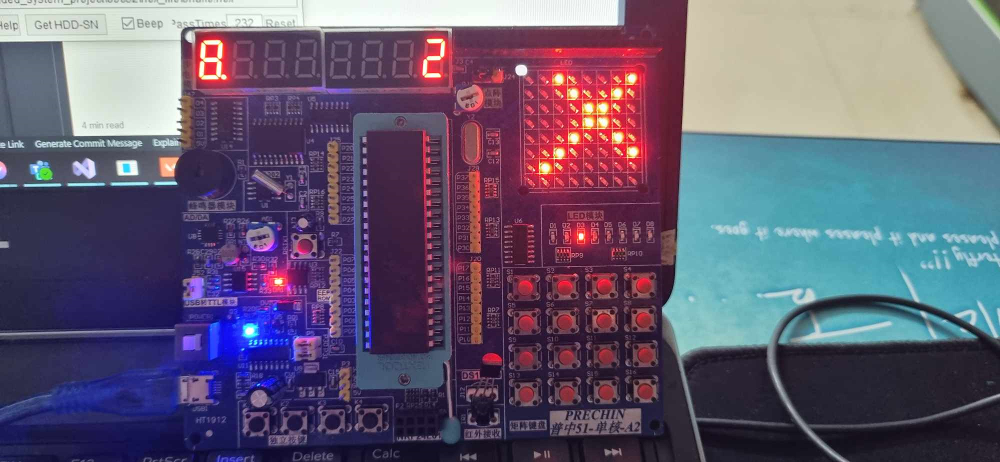

# Mấy điểm về project làm việc với hệ nhúng
# Project bao gồm 4 phần
>* ##  Điều khiển mạch stc 89c52 bằng dòng lệnh thông qua LCd 16x2 và điều khiển hồng ngoại
>* ## Game rắn săn mồi trên ma trận Led 8*8 
>* ## Điều khiển một điểm sáng di chuyển qua 2 ma trận led 8*8 của 2 mạch stc 89c52 thông qua giao thức UART
>* ## Điều khiển một số thiết bị ngoại vi với esp32 : servo, joystick, led, uart

# Cách build chương trình
* ### Đối với stc 89c52 , chạy file runner.bat trong thư mục 89c52. Tất cả các file .c sẽ được build bằng sdcc. Các file .hex để nạp firmware cho stc 89c52 được đặt riêng trong thư mục hex_file
* ### Đối với esp32, chương trình được đặt trong file main.c . Phần mềm cho esp32 được build bằng platform io. Nếu sử dụng vscode, cài platform io, chọn board và nạp code. Nếu sử dụng arduino ide, tạo project mới, sửa file main.c thành file sketch.ino và cho tất cả các file còn lại vào thư mục libraries. Sau đó build và nạp code

# Điều khiển stc 89c52 với giao diện dòng lệnh hiển thị trên lcd 1602 , sử dụng điều khiển hồng ngoại hoặc ma trận phím.
> ## Chương trình được cài đặt trong file main.c ; sau khi build, file để nạp firmware là main.h
## Cách sử dụng:
> Sử dụng điểu khiển hoặc ma trận phím để chạy chương trình. Bấm các phím từ 0->9 để nhập kí tự, kí tự được nhập tương đối giống với trên các thiết bị điện thoại cũ ( ví dụ phím 2 bao gồm các kí tự a,b,c,2 )
> Sau khi nhập lệnh , bấm phím màu xanh trên điều khiển để thực hiện lệnh.
> Một số lệnh chương trình hỗ trợ như :
> * Timer + < Thời gian >  : ví dụ "Timer 25" . Chương trình sẽ tự đếm ngược từ 25 về 0, khi về 0 sẽ có tiếng beep.
> * stopwatch  : Đếm từ 0 , ngược lại với timer.
> * buzzer : tạo tiếng beep ( tiếng chuông từ buzzer)
> * show + < số > : ví dụ "show 245" : in ra số 245 trên led 7 thanh.
> * led off : tắt led 7 thanh.
> * fan on / fan off : bật / tắt quạt ( chân điều khiển quạt là P2_0 , phải có transitor)
> * temperature : hiển thị trên mành hình led 7 thanh giá trị nhiệt độ được làm tròn.
## Demo

## Thiết kế chương trình:

* ### Chi tiết về điểu khiển các thiết bị ngoại vi có thể tìm hiểu ở các tài liệu liên quan như schematic, sdcc, và chú thích code.
* ### Một số điểm quan trọng:
>* ### Một đồng hồ được sử dụng với thời gian ngắt ngắn, cập nhật 1 biến đếm long để bắt thời điểm với độ chính xác cao. Mục đích để lấy thời điểm xuất hiện ngắt hồng ngoại.
>* ### Một đồng hồ còn lại được sử dụng với thời gian ngắt thưa hơn, để đếm từng giây cho các tác vụ đếm giờ như timer, stopwatch.
>* ### Vòng while được cài đặt để nhận tín hiệu ngắt từ ma trận phím, và hiển thị số trên led 7 thanh.
>* ### Tín hiệu hồng ngoại nhận được từ điểu khiển chỉ lấy 1 byte cuối. Sau khi nhận được tín hiệu, không thực hiện lệnh ngay mà đẩy vào 1 hàng đợi. Điều này khắc phục việc, nếu 89c52 nhận quá nhiều tín hiệu điều khiển sẽ bị lag.
>* ### Dòng lệnh chỉ được viết trên 1 dòng của lcd 1602 tại 1 thời điểm. Có phím để chuyển dòng, khi thực hiện lệnh, mạch chỉ lấy giá trị câu lệnh trên dòng hiện tại đang được chính sửa. Điều này là để tiết kiệm bộ nhớ.
>* ### led 7 thanh có hỗ trợ in ra màn hình số âm. 

# Game rắn săn mồi trên ma trận led 8*8.
## Chương trình được cài đặt ở file snake.c , file sau build là snake.hex
## Cách chơi :
>* Bấm phím bất kì để bắt đầu
>* 4 phím điều khiển là phím thứ 2 trên hàng thứ nhất và 3 phím đầu trên hàng thứ 2. Tương tự như các phím mũi tên có trên bàn phím.
>* Điểu khiển rắn ăn mồi để tăng điểm. Mồi là điểm sáng nhấp nháy trên mành hình.
>* Điểm của người chơi hiện trên ma trận led 7 thanh, ở phía bên phải. Có một số 0 ở phía trái, đừng bận tâm, đây là hạn chế của việc trùng chân với điều khiển ma trận led, cũng như sử dụng chung code led 7 thanh của các chương trình khác.
>* Game kết thúc khi rắn chạm biên, hoặc chạm chính nó.
>* Sau khi game kết thúc, sẽ có một dạng hỉnh ảnh chạy hiển thị trên ma trận led.

## Xây dựng game:

### Xây dựng chương trình điểu khiển ma trận led.
>* Mỗi đèn led trong ma trận led được điểu khiển bởi giá trị của 2 chân. 64 đèn cần tổng cộng 16 chân, 1 hàng 8 chân và 1 cột 8 chân, mỗi cặp tương ứng 1 đèn.
>* Giá trị của chân theo hàng được điều khiển thông qua IC dịch và latch, được điểu khiển bởi 3 chân của 89c52 là P34,p35,p36 bao gồm 1 chân data, 1 chân clock và 1 chân latch.
>* Giá trị của cột là giá trị của P0
>* Dữ liệu của các bit 8*8 để hiển thị được lưu trong mảng data_mat, là 1 mảng 8 phần tử char ( để tiết kiệm bộ nhớ)
>* Các toán tử để gán giá trị để điểu khiển ma trận led dều là toán tử bit ( bit manipulation)

### Demo
>Game:

Game over:

https://drive.google.com/file/d/1Ov-C5lpnTSf85BlZtrucXNpACiIgJT74/view?usp=sharing

### Xây dựng Game rắn săn mồi:
 #### Quản lý trạng thái của game thông qua các biến:
 > head : Vị trí đầu rắn
> tail : Vị trí đuôi rắn
> Một cấu trúc dữ liệu đặc biệt để lưu vị trí tiếp theo của đuôi rắn. 
> Dạng Next[u] = v , tức là nếu đuôi rắn đang ở vị trí u, thì tiếp theo đuôi sẽ ở vị trí v.
> Tuy nhiên, Để giảm bớt bộ nhớ cần thiết, ta nhận thấy, vị trí tiếp theo của v chỉ có tối đa 4 khả năng.
> Do đó, ta sẽ sử dụng 2 mảng char, bit0[8] và bit1[8], với ý tưởng tương tự data_mat, ghép 2 giá trị của bit0 và bit1 lại ta sẽ biết vị trí tiếp theo của tail.
> Một biến char để lưu vị trí của mồi. Trong game 1 lúc chỉ có 1 mồi tồn tại
> Một biến lưu hướng di chuyển hiện tại của con rắn

 ### Sau mỗi bước di chuyển của rắn, game sẽ được cập nhật:
 #### Kiểm tra trạng thái của game tại vị trí Head :
> Nếu Head là vị trí của mồi, không cập nhật tail, tăng điểm
> Nếu Head là vị trí bình thường, cập nhật Head, cập nhật tail, cập nhật giá trị next[Head] = new Head
> Nếu Head là vị trí biên, hoặc chính là con rắn , thì game kết thúc.

#### Bật đèn led tại ví trí của Head
#### Tắt đèn led tại vị trí của Tail
#### Trạng thái của game được upate ( con rắn sẽ di chuyển) sau:
> * Người dùng bấm phím điều khiển. Nếu hướng điều khiển khác với hướng hiện tại của con rắn, thì update trạng thái game
> * Sau một khoảng thời gian nhất định, cập nhật trạng thái game.

#### Một Đồng hồ được sử dụng để:
> * Cập nhật trạng thái game sau mỗi khoảng thời gian nhất định.
> * Bật tắt đèn led tại vị trí mồi để làm cho điểm đó nhấp nháy

# Điều khiển điểm sáng di chuyển giữa 2 mạch.

## File : connect.c
## File hex build : hex_file/dotmove.hex
## Mô tả chung:

Kết nối UART cho 2 mạch stc 89c52. Sau đó, bấm phím di chuyển trên một mạch để điểu khiển điểm sáng ( tương tự game rắn săn mồi)
Sau khi điểm chạm biên phải trên mạch thứ nhất, nó sẽ tự nhảy sang ma trận led trên ma trận led trên 89c52 thứ 2.
Sau đó, ta có thể điểu khiển điểm sáng này bằng phím trên bất cứ mạch nào. Điểm sáng sẽ di chuyển như thể 2 ma trận led được ghép nối với nhau thành 1 màn hình duy nhất.

## Demo
> Lik : https://drive.google.com/file/d/13CB4430RjGp1eXwmp3o1m8yhOIXBbyzr/view?usp=sharing
> Ảnh :
> 

## Nguyên lí:
* Ta sử dụng 1 biến để lưu trạng thái của điểm sáng (dot). 
* Với mỗi lần bấm phím:
> * Nếu như lần dot đang trên mạch được bấm, thực hiện lệnh
> * Nếu như dot không trên mạch được bấm, truyền lệnh thông qua uart sang mạch còn lại.
* Thực hiện lệnh di chuyển:
> * Tính giá trị kế tiếp của dot.
> * Nếu như vị trí kế tiếp quá biên ( không tính biên nối tiếp giữa 2 mạch ) thì không cập nhật gì
> * Nếu vị trí kế tiếp nằm trên mạch khác, gửi tính hiệu bật đèn led vị trí kế tiếp cho mạch còn lại.
> * Nếu vị trí kế tiếp nằm trên mạch hiện tại, bật đèn led tại vị trí đó.
> * Tắt đèn led tại vị trí hiện tại

## Về cách thức điểu khiển ma trận led, tương tự như đã làm với rắn săn mồi.
## Về giao thức UART :
* Tìm hiểu trong tài liệu liên quan 89c52 :
https://www.stcmicro.com/datasheet/STC89C51RC-en.pdf

# Một vài trò con bò trên mạch esp32 với joystick:

## demo:
https://drive.google.com/file/d/1Os2v-M5jRHhf6sVe-q3SuGL9yTM6VxWA/view?usp=sharing

## Lấy thông tin điểu khiển từ joystick
> * Từ joystick lấy được 2 giá trị x, y. 2 giá trị này có miền giá trị giống nhau, thực nghiệm cho thấy điều đó.
> * Từ 2 giá trị này, sử dụng 1 hàm có sẵn để lấy giá trị góc.
> * Để lấy hướng của joystick, ta xét thêm biên độ , tức là căn((x-x_mean)^2+(y-y_mean)^2) , đại loại là độ lệch khỏi ví trí bình thường; chỉ khi đủ lớn mới cho giá trị hướng.
> * Để lấy sự kiện bấm nút joystick, ta để ý, khi joystick được bấm, 2 điện trở bị nối tắt. Kết quả là, các giá trị x, y trở lên lớn bất thường => biên độ cũng lớn bất thường.

## Từ giá trị của joystick,  triển khai mấy trò vui vui :
> * Điều khiển góc của servo tương ứng với góc trên joystick. Hơi buồn là joystick chỉ điều khiển được 180 độ
> * Cắm 4 cái đèn led vào 4 góc. Tương ứng với hướng của joystick, bật sáng đèn tương tự. 
> * sử dụng hướng của joystick để chơi game rắn săn mồi
> * Sử dụng hướng của joystick, kết nối với 2 mạch 89c52 để điểu khiển 1 điểm sáng di chuyển trên 2 ma trận 8*8.
> * Vị trí của điểm sáng sử dụng số thực, để tính toán các hướng với các góc thực.

#### Trải nghiệm của tác giả sau prj
> (Nói vui thoy, mong thầy Tiến không đọc =)))) )
> Tìm chân vs docs trên 89c52 muốn lòi cả con mắt
> Đặc biệt lúc làm việc với ma trận led, mặc dù code đúng, nhưng phải lắp lại cái dăm ngay trên ma trận led thì nó mới sáng được
> joystick thì như quầng què, chả chính xác tẹo gì
> Phải nối chân khi nối Uart =))) ai biết đou, thấy nó không cháy tưởng là ổn
> 89c52 hỏng cảm biến nhiệt hay sao ấy. ultr =)))
> Đừng hỏi copilot chat hay chat gpt về 89c52. Nó trả lời như muốn ăn đập :))) . Tìm docs đọc, hoặc lên mấy trang của tàu khựa.
> Lập trình trên 89c52 thì phải để ý bộ nhớ, nếu không muốn ngồi config sdcc. Hoặc cũng có cách dùng xdata, idata chết tiệt gì đấy.
>Cơ mà vẫn nên chú ý, ví dụ, khi đếm mà biến đếm nhỏ, thay vì dùng biến int, ta dùng biến char.
>Hay như, nếu có nhiều vòng for, khai báo biến đếm trước rồi mới dùng. Hết vòng for trình chạy nó không giải phóng bộ nhớ cho biến đếm đâu :))
> 

Làm xong thấy hơi buồn, hơi tiếc. Chắc nao kiếm thêm prj làm chơi chơi :))